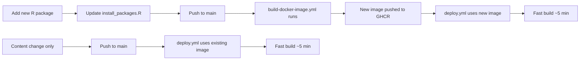

# Docker Image for Fast CI Builds

## Overview

This project uses a custom Docker image with all R packages pre-installed to dramatically speed up CI/CD builds.

**Build time improvement:**
- ❌ Before: ~40 minutes (installing packages every time)
- ✅ After: ~5 minutes (packages already installed in image)

## How It Works

### 1. Custom Docker Image

The `Dockerfile` builds an image based on `rocker/tidyverse:4.5` with:
- All system dependencies (libmagick, librsvg, cmake)
- All R packages from `.github/workflows/install_packages.R`
- Configured RSPM for binary packages

**Image location:** `ghcr.io/stanstrup/figure_presentation:latest`

### 2. Automated Image Building

The `.github/workflows/build-docker-image.yml` workflow:
- **Triggers when:**
  - `install_packages.R` changes (new packages added)
  - `Dockerfile` changes (base image or system dependencies)
  - Manually via workflow_dispatch
- **Builds and pushes:** Updated image to GitHub Container Registry (GHCR)
- **Uses layer caching:** Rebuilds are fast (~10 minutes)

### 3. Fast Deployment Workflow

The `.github/workflows/deploy.yml` workflow:
- **Uses:** Pre-built Docker image `ghcr.io/stanstrup/figure_presentation:latest`
- **Skips:** Package installation entirely
- **Only renders:** Quarto slides, book, and quiz
- **Total time:** ~5 minutes instead of 40 minutes

## Workflow



## When Image Rebuilds

The Docker image automatically rebuilds when you modify:
- `.github/workflows/install_packages.R` - New R packages
- `Dockerfile` - Base image or system dependencies
- `.github/workflows/build-docker-image.yml` - Build process

**Manual rebuild:**
```bash
# Go to Actions tab → "Build and Push Docker Image" → "Run workflow"
```

## Image Visibility

The Docker image is stored in GitHub Container Registry (GHCR):
- **Public package:** Anyone can pull the image
- **Repository settings:** Package > Change visibility > Public
- **URL:** https://github.com/stanstrup/figure_presentation/pkgs/container/figure_presentation

## Local Development

You can also use this image locally for consistent builds:

```bash
# Pull the pre-built image
docker pull ghcr.io/stanstrup/figure_presentation:latest

# Run container with your local code
docker run -it --rm \
  -v $(pwd):/workspace \
  ghcr.io/stanstrup/figure_presentation:latest \
  bash

# Inside container, render as usual
quarto render presentation.qmd
```

## Building Image Locally

```bash
# Build locally (takes ~10-15 minutes first time)
docker build -t figure-presentation-r .

# Test the image
docker run -it --rm \
  -v $(pwd):/workspace \
  figure-presentation-r \
  Rscript -e "library(ggplot2); library(viridis); sessionInfo()"
```

## Troubleshooting

### Image build fails
- Check `.github/workflows/install_packages.R` for errors
- Verify all packages are available on RSPM/CRAN
- Check system dependencies in Dockerfile

### Deploy workflow can't find image
- Ensure Docker image workflow completed successfully
- Check package visibility is set to Public
- Verify image tag matches in deploy.yml

### Packages still installing during deploy
- Check that deploy.yml uses correct image: `ghcr.io/${{ github.repository }}:latest`
- Ensure "Install R packages" step is removed from deploy.yml

## Benefits

✅ **40-minute savings** per build
✅ **Consistent environment** across all builds
✅ **Easier debugging** - can test locally with same image
✅ **Version controlled** - Dockerfile tracks environment changes
✅ **Automatic updates** - rebuilds when packages change
